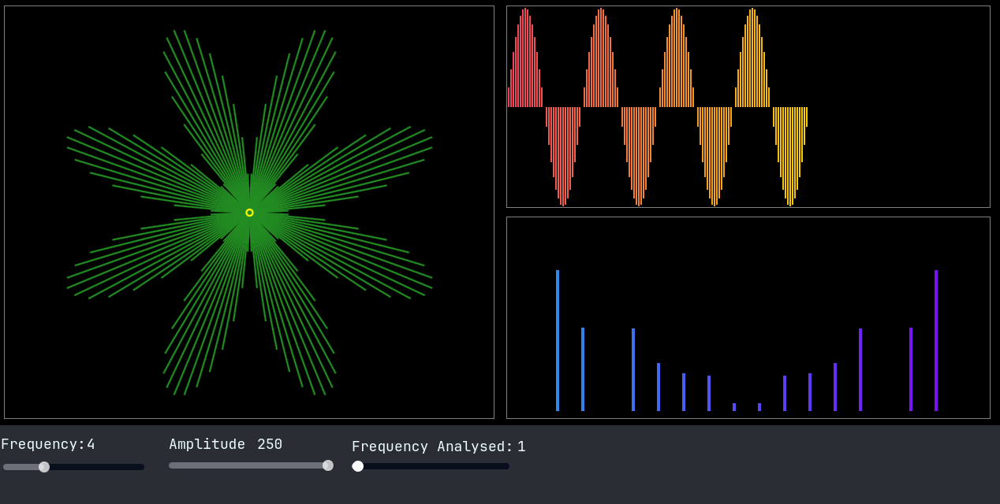
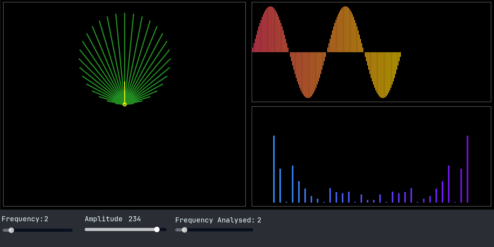
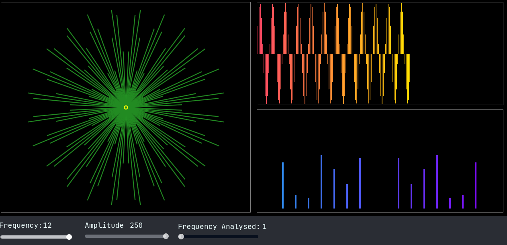

# Fourier Coding Adventure

A visualization of the Fourier Transform made with Godot 4.
Inspired by [Grant Sanderson's (3Blue1Brown) video about the Fourier Transform](https://www.youtube.com/watch?v=spUNpyF58BY)

- [What is the Fourier Transform?](https://en.wikipedia.org/wiki/Fourier_transform)
- [The Fast Fourier Transform](https://www.jeremykun.com/2012/07/18/the-fast-fourier-transform/)
